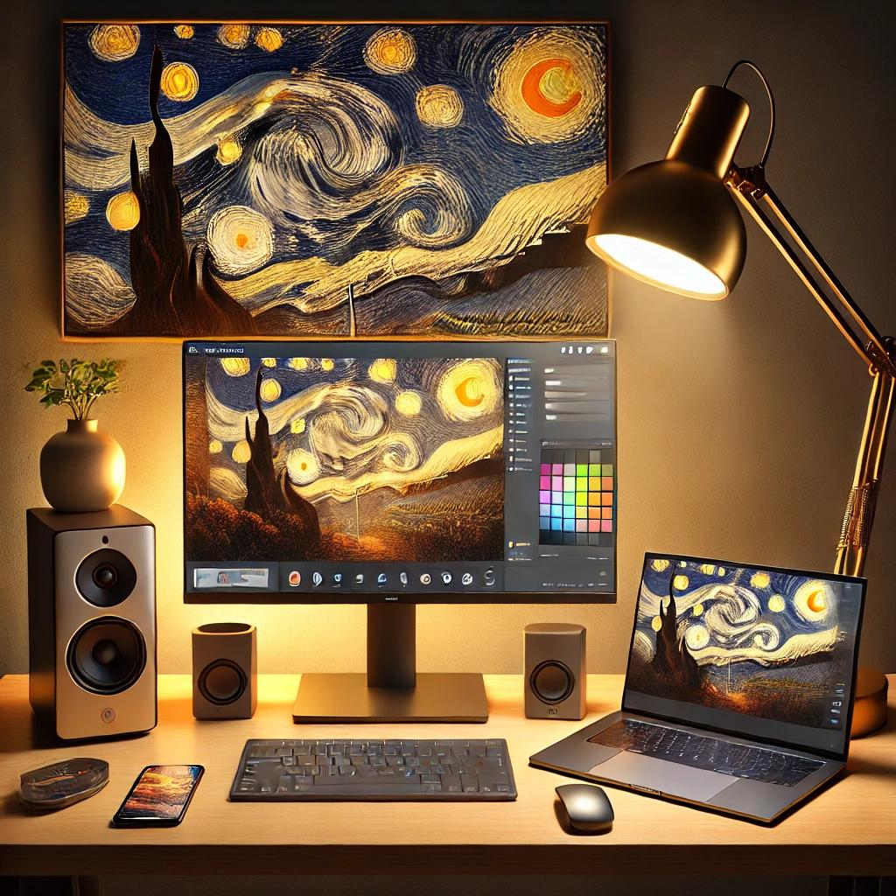
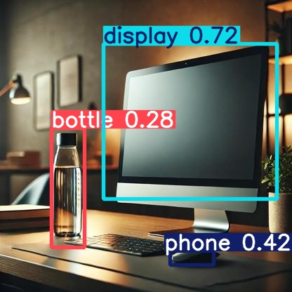
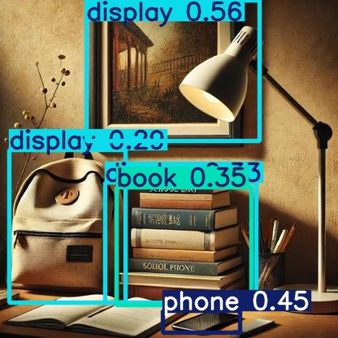

# YOLOv5 Object Detection on Custom Dataset

## **Project Overview**
This project demonstrates training and evaluating the YOLOv5 object detection model on a custom dataset generated using AI tools. The dataset contains 10 object categories: `lamp`, `display`, `cup`, `book`, `phone`, `painting`, `bottle`, `bag`, `speaker`, and `human`.

---

## **Dataset**
- **Image Source**: AI-generated images using OpenAI's DALL·E.
- **Resolution**: Resized to 416x416 pixels.
- **Split**:
  - Training: 70%
  - Validation: 20%
  - Testing: 10%
- **Annotations**: YOLO-compatible format with normalized bounding box coordinates.

Sample Original Images from dataset:



---

## **Training Settings**
- **Model**: YOLOv5s
- **Parameters**:
  - Confidence Threshold: 0.5
  - Image Size: 416x416
  - Epochs: 20
  - Batch Size: 16
  - Optimizer: SGD
- **Hardware**: NVIDIA GeForce RTX 2060 (6 GB)

### **Training Command**
```bash
python train.py --data "path/to/data.yaml" --weights yolov5s.pt --epochs 20 --imgsz 416 --batch-size 16 --device 0
```

---

## **Evaluation**
- **Metrics**:
  - mAP@0.5: **0.468**
  - Best Classes: `Bottle` (0.862), `Display` (0.836)
  - Weakest Classes: `Lamp` (0.076), `Human` (0.000)

### **Testing Command**
```bash
python detect.py --weights runs/train/exp3/weights/best.pt \
--source "path/to/test/images" --imgsz 416
```

---

## **Results**
1. **Sample Metrics**:
   - Precision and recall values across all classes.
   - Average F1 score and mAP.

2. **Visualizations**:
   - F1-Confidence Curve
   - Precision-Recall Curve
   - Confusion Matrix (attached in repo).

Sample test images with generated labels:




---

## **Conclusion**
The model achieved moderate success but struggled with underrepresented classes and overlapping objects. Future improvements include augmenting the dataset, addressing class imbalance, and fine-tuning hyperparameters.

---

## **Folder Structure**
```plaintext
- Dataset/
  - images/
    - train_resized/
    - val_resized/
    - test_resized/
  - labels/
    - train_resized/
    - val_resized/
    - test_resized/
- yolov5/
  - train.py
  - detect.py
```

---

## **Future Work**
1. Increase dataset size and class balance.
2. Experiment with smaller YOLO architectures for faster training.
3. Deploy the trained model in a real-time detection pipeline.

---

Feel free to clone the repo and explore the training and evaluation pipeline! 🚀
